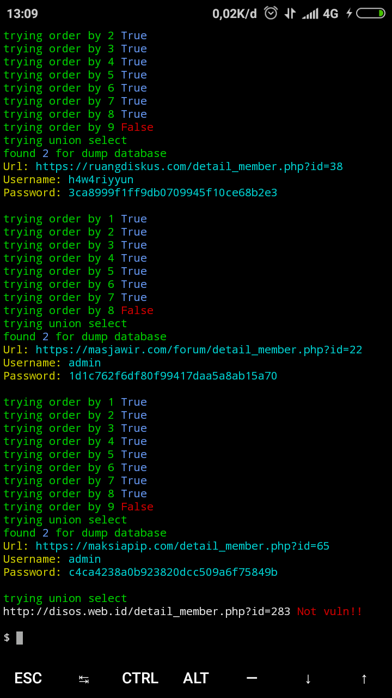

# auto-sqli-web-forum

 
<h3>Requirements:</h3>

requests

colorama

bs4

 
<h3>Run:</h3>

python sqli.py <target.txt>

 

screenshot:

 
<h2>Demo: <a href="https://youtu.be/McEaJ2EiKm0">click</a></h2>
